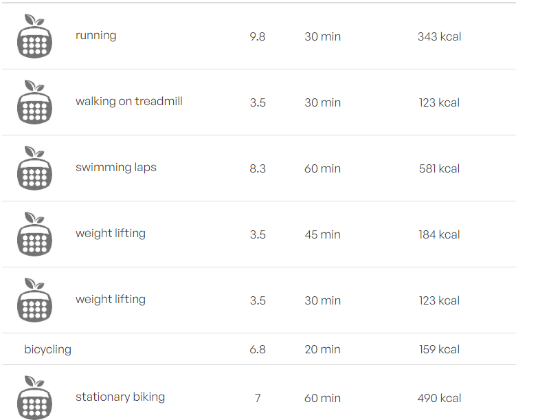

# NLP_Integrated_health_tracker

This README provides visual representations of the project using screenshots.

**Simple Query**
30 minutes of running 1 hour of swimming 45 minutes of weightlifting 20 minutes of biking 15 minutes of yoga 10 minutes of stretching

**Complex Query**
30 minutes of running on a treadmill at a 10% incline 1 hour of swimming laps in a pool 45 minutes of lifting weights using a 5x5 weightlifting program 20 minutes of biking on a stationary bike at a moderate resistance 15 minutes of yoga following a Sun Salutation sequence 10 minutes of static stretching, holding each stretch for 30 seconds

## S1

## S2

## S3

## S4

## S5

**Query**
Breakfast: 1 cup oatmeal with 1 banana 2 eggs
Lunch: Rice Dal Vegetable 1/2 cup curd
Dinner: Chicken with 2 Chapatis
Snacks: 1 apple and 1 ounce of almonds
## S5

)

